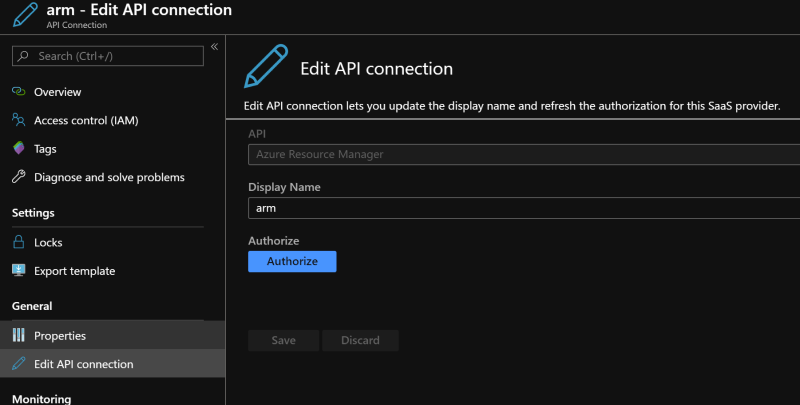
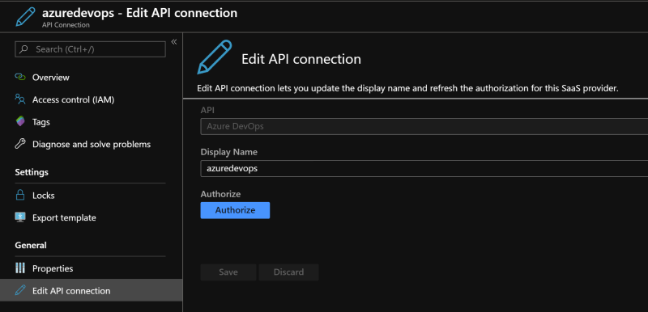
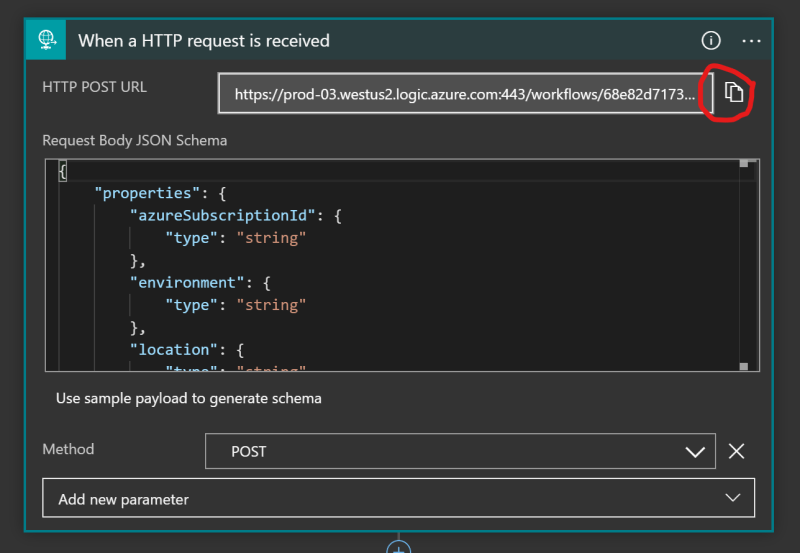
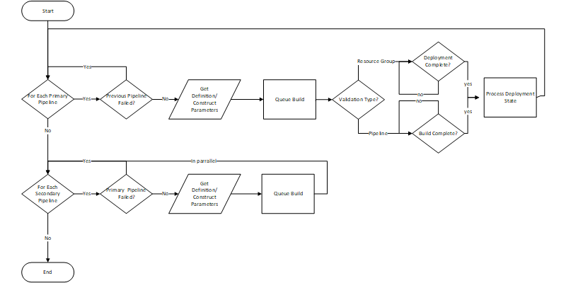

# Using Azure Logic App for Azure DevOps Pipeline Orchestration

<!-- 
Guidelines on README format: https://review.docs.microsoft.com/help/onboard/admin/samples/concepts/readme-template?branch=master

Guidance on onboarding samples to docs.microsoft.com/samples: https://review.docs.microsoft.com/help/onboard/admin/samples/process/onboarding?branch=master

Taxonomies for products and languages: https://review.docs.microsoft.com/new-hope/information-architecture/metadata/taxonomies?branch=master
-->

This sample provides an Azure Resource Manager template for a Azure Logic app that can be used to orchestrate the execution of many Azure DevOps Pipelines. The Logic App is an HTTP triggered logic app that accepts a POST method. The payload has two arrays defined. The first array is the information for the pipelines that will need to be executed synchronously. The second is the information on the pipelines that, once the synchronous pipelines are completed, can be executed asynchronously.

## Contents

| File/folder       | Description                                             |
|-------------------|---------------------------------------------------------|
| `samples`         | Sample payloads that are sent to the app for execution. |
| `azuredeploy.json`| The Azure Resource Manager template that contains the sample application. |
| `.gitignore`      | Define what to ignore at commit time.                   |
| `README.md`       | This README file.                                       |
| `LICENSE`         | The license for the sample.                             |
| `SECURITY`        | Microsoft OOS Security disclosure.                      |
| `CODE_OF_CONDUCT` | Microsoft OOS code of conduct.                          |

## Prerequisites

* Azure subscription
* Azure DevOps subscription
* Azure DevOps Pipelines defined

## Setup

To setup this sample execute the follow steps in order.

* Create a resource group within your Azure subscription

``` bash
az group create -n {name of resource group to create}
```

* Deploy the [Azure Resource Manager Template](./azuredeploy.json)

``` bash
az group deployment create -g {name of resource group created} --template-file azuredeploy.json
```

* Authenticate the arm API Connector that was deployed with the template
  * Navigate to the "Edit API Connection" blade of the arm API Connection Resource
  * Click the "Authorize"
  * Login to the appropriate Azure Subscription



* Authenticate the azuredevops API connector that was deployed with the template
  * Navigate to the "Edit API Connection" blade of the azuredevops API Connection Resource
  * Click the "Authorize"
  * Login to the appropriate Azure DevOps subscription



## Runnning the sample

To run do the following

* Acquire the URL from the deployed logic app.
  * Open the logic app's designer view blade
  * Click on the "When a HTTP request is received" action
  * Copy the url

    

  * Construct the payload for the post request using the [Pipeline Orchestration Payload Documentation](./PIPELINE_PAYLOAD.md).
  * Use your url posting tool of choice (Postman, curl, etc...). To post the request to the Logic app

## Key concepts

This sample allows for orchestration of many Azure DevOps pipelines using an Azure Logic App. This is very useful for scenarios where a series of discrete Azure DevOps pipelines are used to create/maintain/update small services within a larger ecosystem of services. In this environment you would want to have CI/CD pipelines created to allow for each distcrete service to by deployed individually. However, when a new environment is required, be it for testing, development, scaling, disaster recovery, etc., creating that new environment requires the execution of those pipelines in specific sequences and differing parameters.

This sample allows for those scenarios by:

* queing builds of the pipelines
* with provided parameters
* in the sequence defined

It also allows for pipelines to be queued asychroniously, after the primary pipelines have completed.

Refer to the [pipeline payload documentation](./PIPELINE_PAYLOD.md) to see how to provide that information.

You can review the detailed workflow of the Logic App after you deploy it to your Azure Subscription, but at a high level the Logic App uses the following work flow:



<!--
TODO: insert video demoing this execution here
-->

## Contributing

This project welcomes contributions and suggestions.  Most contributions require you to agree to a
Contributor License Agreement (CLA) declaring that you have the right to, and actually do, grant us
the rights to use your contribution. For details, visit https://cla.opensource.microsoft.com.

When you submit a pull request, a CLA bot will automatically determine whether you need to provide
a CLA and decorate the PR appropriately (e.g., status check, comment). Simply follow the instructions
provided by the bot. You will only need to do this once across all repos using our CLA.

This project has adopted the [Microsoft Open Source Code of Conduct](https://opensource.microsoft.com/codeofconduct/).
For more information see the [Code of Conduct FAQ](https://opensource.microsoft.com/codeofconduct/faq/) or
contact [opencode@microsoft.com](mailto:opencode@microsoft.com) with any additional questions or comments.
